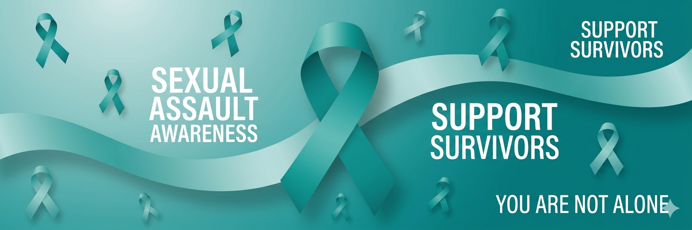

# every-74-seconds

A real-time public awareness website that visualizes the scale of sexual violence in the U.S. using live-updating counters, stadium dot visualizations, and tally marks drawn from NCVS data. Its title refers to the frequency with which an individual is sexually assaulted in the country according to data from the Rape, Abuse & Incest National Network (RAINN). The site provides a stark, data-driven look at the scope of this issue to educate the public and drive social change.

The primary purpose of the resource is to humanize these statistics and provide a space for education, prevention, and survivor support. By highlighting the frequency and impact of sexual assault, the website encourages visitors to engage with the reality of the problem and seek out resources for help. It often acts as a portal to broader advocacy efforts, connecting users with crisis hotlines and educational tools designed to end sexual violence and support those in recovery.
